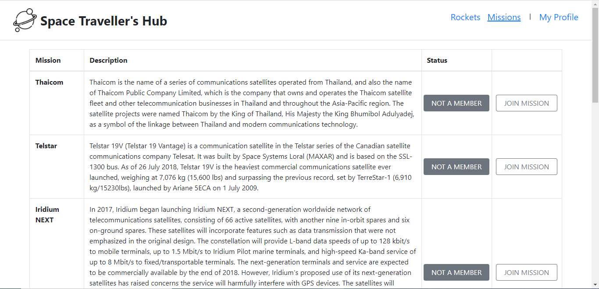
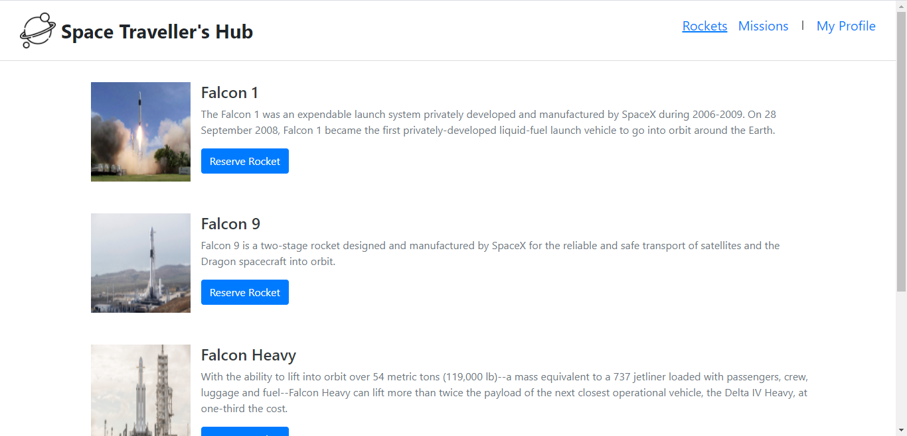
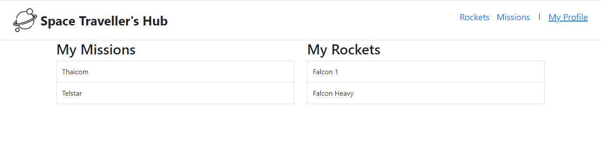

# Space Traveler's Hub

> For this app we are using the real live data from the SpaceX API. We build a web application for a fake company that provides commercial and scientific space travel services. The application will allow users to book rockets and join selected space missions.

## Built With

- HTML/CSS
- React
- Redux
- Bootstrap
- Javascript
- Jest

## Live Demo

[Live Demo Link](https://space-travelers-hub-octavio-francis.netlify.app/)

## Getting Started

To get a local copy up and running follow these simple example steps.

### Prerequisites

 - Node >= 10.16
 - npm >= 5.6

### Setup

  - run 'git clone https://github.com/LOctavio/space-travelers-hub.git' to clone the project

### Install

  - run 'npm install'

### Usage

  - open th project directory and you will see all the project files

### Run tests

  - run 'npm run test'

### Deployment

 - run 'npm start' to run the server

## Authors

👤 **Francis Uloko**
- [GitHub](https://github.com/francisuloko)
- [Twitter](https://twitter.com/francisuloko)
- [LinkedIn](https://linkedin.com/in/francisuloko)

👤 **Luis Octavio Ramirez Cruz**

- GitHub: [LOctavio](https://github.com/LOctavio)
- Twitter: [@Octavio_ram431](https://twitter.com/Octavio_ram431)
- LinkedIn: [Luis Octavio Ramirez Cruz](https://www.linkedin.com/in/luis-octavio-ramirez-cruz/)

## 🤝 Contributing

Contributions, issues, and feature requests are welcome!

Feel free to check the [issues page](https://github.com/LOctavio/space-travelers-hub/issues).

## Show your support

Give a ⭐️ if you like this project!

## Acknowledgments

- Hat tip to anyone whose code was used
- Inspiration
- etc

## 📝 License

This project is [MIT](./MIT.md) licensed.
